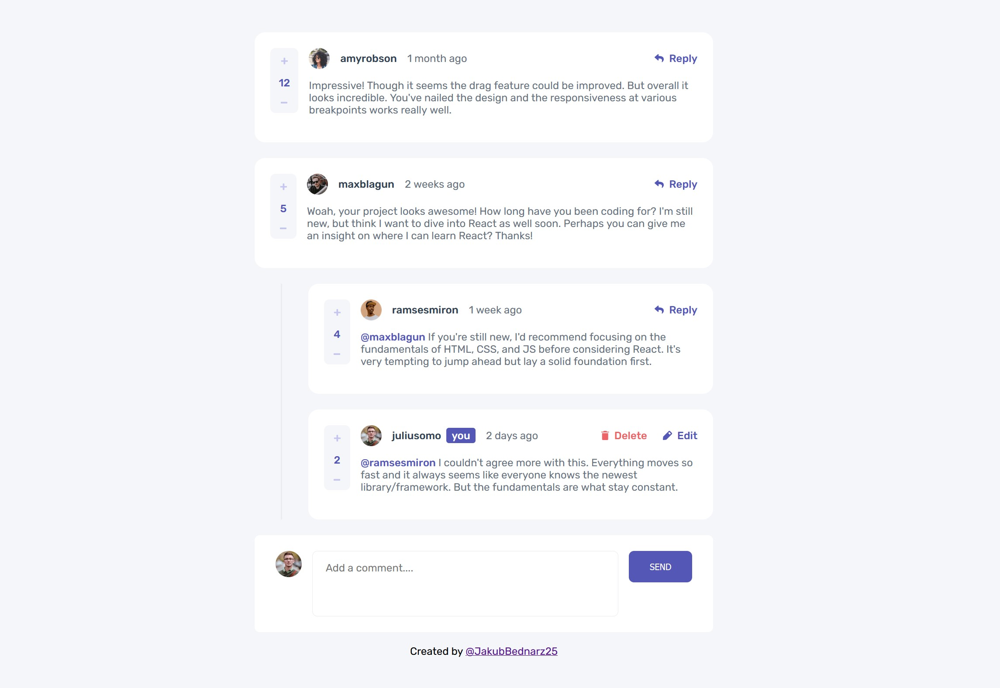

# Frontend Mentor - Interactive comments section solution

## Table of contents

- [Overview](#overview)
  - [The challenge](#the-challenge)
  - [Screenshot](#screenshot)
  - [Links](#links)
- [My process](#my-process)
  - [Built with](#built-with)
- [Author](#author)

## Overview

### The challenge

Users should be able to:

- View the optimal layout for the app depending on their device's screen size
- See hover states for all interactive elements on the page
- Create, Read, Update, and Delete comments and replies
- Upvote and downvote comments

### Screenshot

### Links

- Solution URL: [https://jakubbednarz25.github.io/interactive-comments-section-frontend-mentor/](https://jakubbednarz25.github.io/interactive-comments-section-frontend-mentor/)
- Live Site URL: [https://jakubbednarz25.github.io/interactive-comments-section-frontend-mentor/](https://jakubbednarz25.github.io/interactive-comments-section-frontend-mentor/)

## My process

### Built with

- Semantic HTML5 markup
- Flexbox
- Plain HTML + CSS

## Author

- GitHub - [Jakub bednarz](https://github.com/JakubBednarz25)
- Frontend Mentor - [@JakubBednarz25](https://www.frontendmentor.io/profile/JakubBednarz25)
